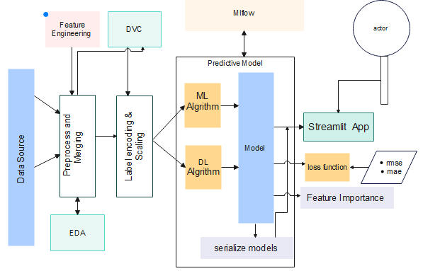

# Rossmann_Pharmaceutical_sales_Prediction
## Introduction
Machine Learning is a subset of AI which uses statistical methods to enable machines to improve with experiences. Deep Learning is a part of Machine learning, which makes the computation of multi-layer neural networks feasible. It takes advantage of neural networks to simulate human-like decision making. 
## Objective
The finance team at Rossmann Pharmaceuticals wants to forecast sales in all their stores across several cities six weeks ahead of time so that, forecasting the sales prediction using machine learning and deep learning as well as exploring the customer purchasing behavior is to be conducted and draw conclusion in this project.

## Sales prediction workflow diagram


## Data
The data for project can be found at [Rossmann Store Sales | Kaggle](https://www.kaggle.com/competitions/rossmann-store-sales/data)

You can find the full list of requirements in the requirements.txt file

## Install

> Highly recommended to create a new virtual environment and install every required modules and libraries on the virtual environment.

### Installing this application

- You can clone and run the project using the following instruction 

```
git clone https://github.com/Rossmann_Pharmaceutical_sales_Prediction.git
cd Rossmann_Pharmaceutical_sales_Prediction
pip install -r requirements.txt
```

## Screenshots

> The detailed implementation of the sales prediction system with streamlit app, mlflow  and the workflows are found here.

## Notebooks

> The notebooks that are used in this project including EDA, data cleaning and different insights regarding the sales data are found here in the Notebooks folder.

## Scripts

> All the scripts and modules used for this project relating are found in the scripts folder

## Tests

> All the unit and integration tests are found here in the tests folder.

## Authors

> 👤 **Akubazgi Gebremariam**
>
> - [Email](mailto:axutec14@gmail.com), [GitHub](https://github.com/ekubay), [LinkedIn](https://www.linkedin.com/in/ekubay/)

## Show your support

> Give a ⭐ if you like this project, and also feel free to contact me at any moment.
